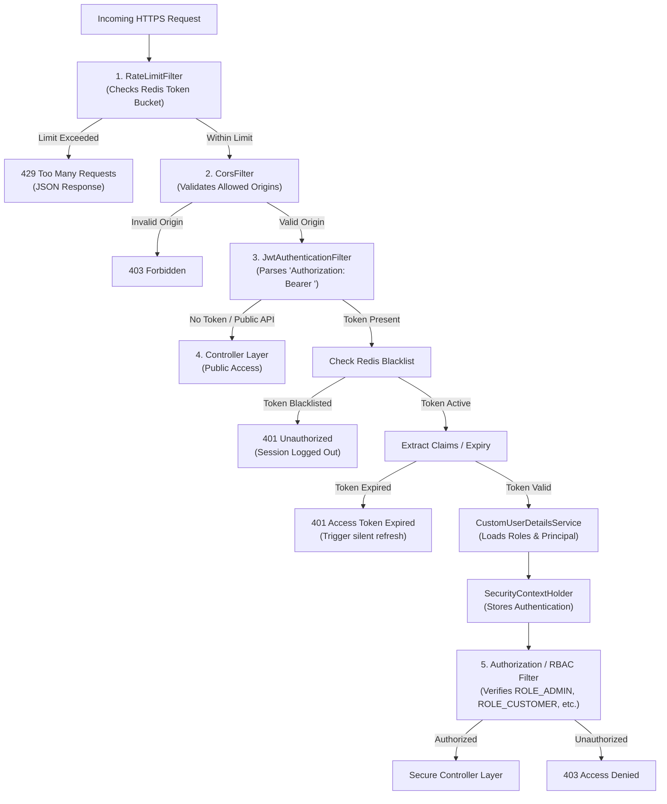

# Phase 3: Security Architecture Blueprint

This blueprint covers the complete Spring Security integration, JWT token rotation mechanics, Redis blacklist design, secure cookie implementations, rate limiting, and audit logging for the Smart E-Commerce Platform.

---

## 1. Enterprise Security Filter Chain

Spring Security 6.x is configured in a stateless manner. The filter chain intercepts every request to validate rate limits, CORS configurations, and active JWT tokens before routing requests to controllers.



---

## 2. JWT Access and Refresh Token Lifecycle

The platform uses a secure double-token system:
- **Access Token (Short-lived)**: Parsed from `Authorization: Bearer` header. Valid for **15 minutes**. Used for stateless request authorization.
- **Refresh Token (Long-lived)**: Stored in an **HttpOnly, Secure, SameSite=Strict** cookie. Valid for **7 days**. Used to request new access tokens securely.

### Token Rotation Flow (Silent Refresh)

When an access token expires (401), the frontend intercepts the failure and requests a silent rotation via `/auth/refresh`:

```mermaid
sequenceDiagram
    autonumber
    actor Client as React Client
    participant API as Spring Boot API
    participant Redis as Redis Cache
    participant DB as MySQL DB

    Client->>API: POST /auth/refresh (Sends HttpOnly Refresh Cookie)
    API->>Redis: Get Refresh Token (Validates active session)
    
    alt Refresh Token Expired or Revoked
        Redis-->>API: Not Found / Revoked
        API-->>Client: 401 Unauthorized (Force Logout)
    else Refresh Token Valid
        Redis-->>API: Token Active & Valid
        API->>DB: Fetch User details by ID
        API->>API: Generate NEW Access Token (15 mins)
        API->>API: Generate NEW Refresh Token (Rotation)
        API->>Redis: Save New Refresh Token (Delete old)
        API-->>Client: Cookie: Set New Refresh; JSON: New Access Token
    end
```

---

## 3. Redis Caching & Blacklisting Key Structures

Redis acts as a high-speed validator to support immediate stateless logouts and brute-force IP rate limiting:

1. **Token Blacklist Key**:
   - **Format**: `ecommerce:blacklist:token:<jwt_signature_hash>`
   - **Value**: `"revoked"`
   - **TTL**: Remaining lifetime of the access token. Once expired, the key self-evicts.
2. **Refresh Token Session Store Key**:
   - **Format**: `ecommerce:refresh:user:<user_id>`
   - **Value**: `<refresh_token_string>`
   - **TTL**: 7 days.
3. **API Rate Limiter Key**:
   - **Format**: `ecommerce:rate:ip:<ip_address>:<endpoint>`
   - **Value**: Current remaining tokens in the bucket.
   - **TTL**: 60 seconds (re-evaluating window).

---

## 4. Custom Security Core Class Interfaces

To achieve this secure flow, the following classes are defined in the backend codebase:

### 1. `JwtTokenProvider`
Provides core utility functions to generate, parse, and validate JSON Web Tokens using `io.jsonwebtoken`:

```java
package com.ecommerce.security;

import io.jsonwebtoken.Claims;
import io.jsonwebtoken.Jwts;
import io.jsonwebtoken.SignatureAlgorithm;
import org.springframework.beans.factory.annotation.Value;
import org.springframework.security.core.userdetails.UserDetails;
import org.springframework.stereotype.Component;
import java.util.Date;
import java.util.HashMap;
import java.util.Map;
import java.util.function.Function;

@Component
public class JwtTokenProvider {
    @Value("${app.jwt.secret}")
    private String jwtSecret;

    @Value("${app.jwt.accessTokenExpirationMs}")
    private long jwtExpirationInMs;

    public String generateToken(UserDetails userDetails) {
        return createToken(new HashMap<>(), userDetails.getUsername(), jwtExpirationInMs);
    }

    private String createToken(Map<String, Object> claims, String subject, long expirationMs) {
        return Jwts.builder()
                .setClaims(claims)
                .setSubject(subject)
                .setIssuedAt(new Date(System.currentTimeMillis()))
                .setExpiration(new Date(System.currentTimeMillis() + expirationMs))
                .signWith(SignatureAlgorithm.HS512, jwtSecret)
                .compact();
    }

    public Boolean validateToken(String token, UserDetails userDetails) {
        final String username = extractUsername(token);
        return (username.equals(userDetails.getUsername()) && !isTokenExpired(token));
    }

    public String extractUsername(String token) {
        return extractClaim(token, Claims::getSubject);
    }

    public Date extractExpiration(String token) {
        return extractClaim(token, Claims::getExpiration);
    }

    public <T> T extractClaim(String token, Function<Claims, T> claimsResolver) {
        final Claims claims = extractAllClaims(token);
        return claimsResolver.apply(claims);
    }

    private Claims extractAllClaims(String token) {
        return Jwts.parser().setSigningKey(jwtSecret).parseClaimsJws(token).getBody();
    }

    private Boolean isTokenExpired(String token) {
        return extractExpiration(token).before(new Date());
    }
}
```

### 2. `JwtAuthenticationFilter`
Intercepts requests, extracts the authorization header, verifies token status via Redis blacklist, and sets the Security Context:

```java
package com.ecommerce.security;

import jakarta.servlet.FilterChain;
import jakarta.servlet.ServletException;
import jakarta.servlet.http.HttpServletRequest;
import jakarta.servlet.http.HttpServletResponse;
import org.springframework.beans.factory.annotation.Autowired;
import org.springframework.security.authentication.UsernamePasswordAuthenticationToken;
import org.springframework.security.core.context.SecurityContextHolder;
import org.springframework.security.core.userdetails.UserDetails;
import org.springframework.security.web.authentication.WebAuthenticationDetailsSource;
import org.springframework.stereotype.Component;
import org.springframework.web.filter.OncePerRequestFilter;
import java.io.IOException;

@Component
public class JwtAuthenticationFilter extends OncePerRequestFilter {

    @Autowired
    private JwtTokenProvider jwtTokenProvider;

    @Autowired
    private CustomUserDetailsService userDetailsService;

    // Injected TokenBlacklistService
    // @Autowired
    // private TokenBlacklistService blacklistService;

    @Override
    protected void doFilterInternal(HttpServletRequest request, HttpServletResponse response, FilterChain filterChain)
            throws ServletException, IOException {
        final String authHeader = request.getHeader("Authorization");
        String username = null;
        String jwt = null;

        if (authHeader != null && authHeader.startsWith("Bearer ")) {
            jwt = authHeader.substring(7);
            // Verify token is not blacklisted in Redis before continuing
            // if (!blacklistService.isBlacklisted(jwt)) { ... }
            username = jwtTokenProvider.extractUsername(jwt);
        }

        if (username != null && SecurityContextHolder.getContext().getAuthentication() == null) {
            UserDetails userDetails = this.userDetailsService.loadUserByUsername(username);
            if (jwtTokenProvider.validateToken(jwt, userDetails)) {
                UsernamePasswordAuthenticationToken authToken = new UsernamePasswordAuthenticationToken(
                        userDetails, null, userDetails.getAuthorities());
                authToken.setDetails(new WebAuthenticationDetailsSource().buildDetails(request));
                SecurityContextHolder.getContext().setAuthentication(authToken);
            }
        }
        filterChain.doFilter(request, response);
    }
}
```

### 3. `SecurityConfig`
Registers CORS configurations, configures endpoints by role, enforces stateless session management, and wires up our authentication filter:

```java
package com.ecommerce.security;

import org.springframework.beans.factory.annotation.Autowired;
import org.springframework.context.annotation.Bean;
import org.springframework.context.annotation.Configuration;
import org.springframework.security.authentication.AuthenticationManager;
import org.springframework.security.config.annotation.authentication.configuration.AuthenticationConfiguration;
import org.springframework.security.config.annotation.web.builders.HttpSecurity;
import org.springframework.security.config.annotation.web.configuration.EnableWebSecurity;
import org.springframework.security.config.http.SessionCreationPolicy;
import org.springframework.security.crypto.bcrypt.BCryptPasswordEncoder;
import org.springframework.security.crypto.password.PasswordEncoder;
import org.springframework.security.web.SecurityFilterChain;
import org.springframework.security.web.authentication.UsernamePasswordAuthenticationFilter;

@Configuration
@EnableWebSecurity
public class SecurityConfig {

    @Autowired
    private JwtAuthenticationFilter jwtAuthFilter;

    @Bean
    public SecurityFilterChain securityFilterChain(HttpSecurity http) throws Exception {
        http
            .csrf(csrf -> csrf.disable())
            .sessionManagement(session -> session.sessionCreationPolicy(SessionCreationPolicy.STATELESS))
            .authorizeHttpRequests(auth -> auth
                // Public Endpoints
                .requestMatchers("/api/v1/auth/**", "/v3/api-docs/**", "/swagger-ui/**").permitAll()
                // Admin Role Endpoints
                .requestMatchers("/api/v1/admin/**").hasRole("ADMIN")
                // Seller Role Endpoints
                .requestMatchers("/api/v1/seller/**").hasAnyRole("SELLER", "ADMIN")
                // Authenticated Users (Cart, Checkout, Loyalty, Wishlist)
                .requestMatchers("/api/v1/cart/**", "/api/v1/orders/**", "/api/v1/loyalty/**").authenticated()
                .anyRequest().permitAll()
            )
            .addFilterBefore(jwtAuthFilter, UsernamePasswordAuthenticationFilter.class);

        return http.build();
    }

    @Bean
    public PasswordEncoder passwordEncoder() {
        return new BCryptPasswordEncoder();
    }

    @Bean
    public AuthenticationManager authenticationManager(AuthenticationConfiguration config) throws Exception {
        return config.getAuthenticationManager();
    }
}
```

---

## 5. Security Failure & Rate Limit API Examples

### 1. HTTP 401 Unauthorized (JWT Expired)
Returns JSON structured specifically for the frontend to initiate silently refreshing its cookies:
```json
{
  "success": false,
  "message": "Access token expired. Please refresh your session.",
  "data": "TOKEN_EXPIRED",
  "timestamp": "2026-05-07T11:15:00.102"
}
```

### 2. HTTP 429 Too Many Requests (Rate Limiting)
Triggered when an IP exceeds endpoints bounds (e.g., more than 5 login attempts per minute):
```json
{
  "success": false,
  "message": "Too many requests. Please wait before retrying.",
  "data": "RATE_LIMIT_EXCEEDED",
  "timestamp": "2026-05-07T11:15:05.145"
}
```
