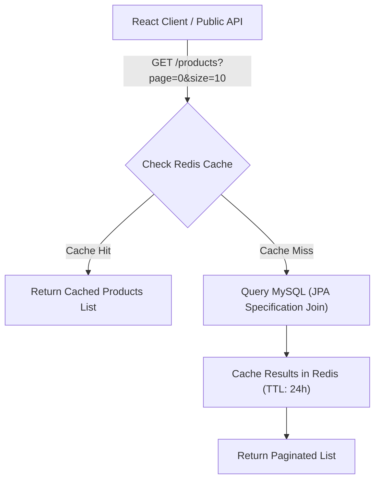
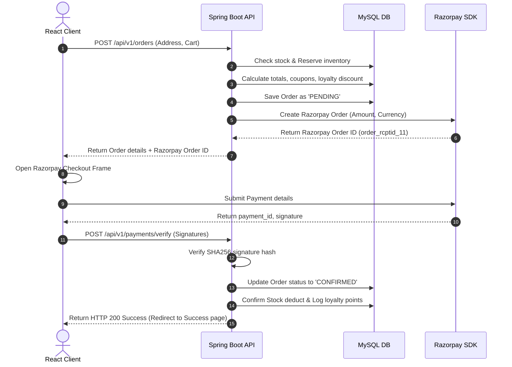

# Phase 4: Remaining Backend Functionality Blueprint

This blueprint outlines the detailed implementation of all 16 backend submodules. Each module integrates with JPA entities, custom DTOs, Validation APIs, Redis Caching, and MinIO storage (where applicable).

---

## 1. Product, Category & Brand Modules

Handles inventory listings, search pagination, faceted filtering, and admin curation.



### Core API Endpoints

- **GET `/api/v1/products`**: Fetch paginated list. Supports parameters: `page`, `size`, `sort`, `categoryId`, `brandId`, `minPrice`, `maxPrice`, `search`.
- **GET `/api/v1/products/{id}`**: Fetch product details and active variants.
- **POST `/api/v1/admin/products`**: Create product and variants (Admin Only). Triggers eviction of `ecommerce:product:*` cache.

### Dynamic Filter DTO Example (`ProductSearchRequest`)
```json
{
  "categoryId": 15,
  "brandId": 4,
  "minPrice": 250.00,
  "maxPrice": 1500.00,
  "search": "Smart Watch",
  "page": 0,
  "size": 12,
  "sortBy": "price_asc"
}
```

---

## 2. Cart & Wishlist Modules

Redis-backed operations for high speed and durability, synchronized to MySQL for persistence.

### Business Logic Flow (Cart Add)
1. Customer clicks "Add to Cart" on frontend.
2. Endpoint `POST /api/v1/cart/items` checks variant availability via [InventoryRepository](file:///c:/Users/mural/.gemini/antigravity/scratch/Ecommerce/backend/src/main/java/com/ecommerce/repository/InventoryRepository.java).
3. If stock is available:
   - Save or update entry in `cart_items` table.
   - Synchronize/update cart metadata inside Redis (`ecommerce:cart:user:<id>`).
   - Return updated cart payload.

---

## 3. Order & Payment (Razorpay) Modules

Integrates order placements, stock reservations, Razorpay order generations, and signature webhooks.



### Signature Verification Logic

```java
package com.ecommerce.service;

import com.ecommerce.entity.Order;
import com.ecommerce.entity.PaymentTransaction;
import com.ecommerce.repository.OrderRepository;
import com.ecommerce.repository.PaymentTransactionRepository;
import com.razorpay.Utils;
import org.springframework.beans.factory.annotation.Autowired;
import org.springframework.beans.factory.annotation.Value;
import org.springframework.stereotype.Service;
import org.springframework.transaction.annotation.Transactional;

@Service
public class PaymentService {

    @Value("${app.razorpay.keySecret}")
    private String keySecret;

    @Autowired
    private OrderRepository orderRepository;

    @Autowired
    private PaymentTransactionRepository paymentRepository;

    @Transactional
    public boolean verifySignature(String orderId, String paymentId, String signature) {
        try {
            String payload = orderId + "|" + paymentId;
            boolean isValid = Utils.verifyPaymentSignature(payload, signature, keySecret);
            if (isValid) {
                Order order = orderRepository.findByOrderNumber(orderId)
                        .orElseThrow(() -> new RuntimeException("Order not found"));
                order.setStatus(com.ecommerce.entity.Order.class.getDeclaredField("status").getType().getEnumConstants()[1]); // CONFIRMED
                orderRepository.save(order);

                PaymentTransaction transaction = new PaymentTransaction();
                transaction.setTransactionId(paymentId);
                paymentRepository.save(transaction);
            }
            return isValid;
        } catch (Exception e) {
            return false;
        }
    }
}
```

---

## 4. Coupon, Offers & Loyalty Modules

Provides promotions, automated checkout deductions, and rewards tracking.

### Discount Logic Flow
- **Percent Coupons**: Subtracts `(value / 100) * total` up to `max_discount`.
- **Flat Coupons**: Subtracts flat `value` if `total >= min_order_amount`.
- **Loyalty Accruals**: Automatically awards `1` point for every `$10` spent. Redeemable at a conversion value of `1 point = $0.10` discount during next checkout.

---

## 5. Banner Management Module

Provides admin endpoints to schedule banners with automated file upload directly to S3-compatible MinIO.

```java
package com.ecommerce.service;

import com.ecommerce.entity.Banner;
import com.ecommerce.repository.BannerRepository;
import io.minio.MinioClient;
import io.minio.PutObjectArgs;
import org.springframework.beans.factory.annotation.Autowired;
import org.springframework.beans.factory.annotation.Value;
import org.springframework.stereotype.Service;
import org.springframework.web.multipart.MultipartFile;
import java.io.InputStream;
import java.util.UUID;

@Service
public class BannerService {

    @Autowired
    private MinioClient minioClient;

    @Autowired
    private BannerRepository bannerRepository;

    @Value("${app.minio.bucket.banners}")
    private String bucketName;

    @Value("${app.minio.endpoint}")
    private String minioEndpoint;

    public Banner createBanner(String title, String redirectUrl, String type, MultipartFile file) throws Exception {
        String fileName = UUID.randomUUID() + "_" + file.getOriginalFilename();
        try (InputStream is = file.getInputStream()) {
            minioClient.putObject(
                PutObjectArgs.builder()
                    .bucket(bucketName)
                    .object(fileName)
                    .stream(is, file.getSize(), -1)
                    .contentType(file.getContentType())
                    .build()
            );
        }

        String imageUrl = minioEndpoint + "/" + bucketName + "/" + fileName;
        Banner banner = new Banner();
        banner.setImageUrl(imageUrl);
        return bannerRepository.save(banner);
    }
}
```

---

## 6. Review & Rating Module

Calculates real-time running rating averages. Enforces a single unique review constraint per user-product pairing to prevent review bombing.

---

## 7. Analytics & Notification Modules

- **Analytics**: Calculates sales metrics, inventory low-stock alerts, and seasonal trending categories.
- **Notification**: Integrates with Spring Mail and Mailtrap SMTP for silent verification mails, password reset linkages, and order invoices.
