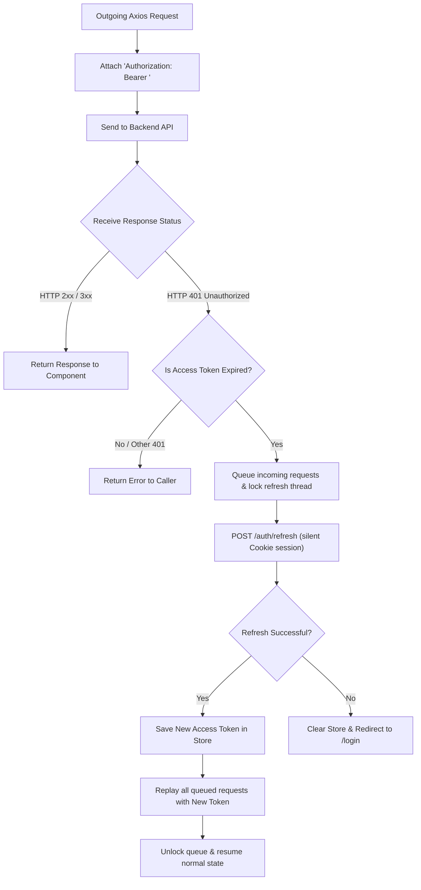

# Phase 5: Frontend Architecture Blueprint

This blueprint outlines the detailed React client configuration, Axios silent token refresh interceptors, routing guards, and global Redux Toolkit store bindings for the Smart E-Commerce Platform.

---

## 1. High-Performance Axios Interceptor State Machine

To enable a seamless "silent refresh" session lifecycle, Axios is configured with automatic dual interceptors:
1. **Request Interceptor**: Automatically attaches the active JWT `Authorization: Bearer <token>` to all outgoing requests.
2. **Response Interceptor**: Listens for HTTP `401 Unauthorized` responses. If an access token expires, it blocks further requests, requests a new token via `/auth/refresh` (using HttpOnly cookies), updates the local store, and replays the original failed request seamlessly.



---

## 2. Global State Management (Redux Toolkit Store Slices)

The platform utilizes a structured **Redux Toolkit** store. Global state is split into isolated slices:
1. **Auth Slice**: Manages active user profiles, permissions, loading states, and current access token strings.
2. **Cart Slice**: Tracks added variants, current item quantities, pricing totals, applied coupons, and synchronization status.
3. **UI Slice**: Manages sidebar states (cart drawer), toast alerts, loading overlays, and dark/light modes.

---

## 3. Premium Interactive Routing Guards (React Router DOM v6)

Protected routes ensure customers and administrators cannot access unauthorized pages:

- **`<ProtectedRoute>`**: Checks if the user is authenticated. If not, redirects them to `/login` while preserving the target path in the router state (supporting instant redirect-backs after login).
- **`<AdminRoute>`**: Checks if the authenticated user possesses `ROLE_ADMIN` permissions. If not, redirects them to an elegant 403 Access Denied page.

```jsx
import React from 'react';
import { Navigate, useLocation } from 'react-router-dom';
import { useSelector } from 'react-redux';

export const ProtectedRoute = ({ children }) => {
  const { isAuthenticated, loading } = useSelector((state) => state.auth);
  const location = useLocation();

  if (loading) {
    return <div className="min-h-screen flex items-center justify-center bg-dark text-primary">Loading...</div>;
  }

  return isAuthenticated ? (
    children
  ) : (
    <Navigate to="/login" state={{ from: location }} replace />
  );
};
```

---

## 4. Premium Aesthetic Layouts & Custom Micro-Animations

Sleek, harmonious designs create an extremely premium impression. Vanilla CSS variables in `styles/index.css` define modern, tailored HSL colors:

```css
:root {
  --background: 220 15% 10%; /* Modern deep dark slate */
  --foreground: 0 0% 98%;
  --primary: 260 85% 65%;    /* Rich cyber purple */
  --primary-hover: 260 85% 55%;
  --accent: 320 80% 60%;     /* Vibrant cyber pink */
  --muted: 215 15% 65%;
  --border: 215 15% 20%;     /* Subtle borders */
  --glass: rgba(15, 23, 42, 0.6);
}
```

### Essential Premium Components

1. **Vibrant Swiper Carousel**: Modern hero landing banners featuring CSS backdrop-blur filters, dynamic text animations, and smooth sliding transitions.
2. **Product Cards Grid**: Modern cards containing:
   - Micro-interactions (image scale-up on hover).
   - Glassmorphism info badges (shows brand, ratings, discount tags).
   - Floating "Add to Cart" button with spring hover transitions.
3. **Sliding Cart Drawer**: Clean sliding panel with a blur backdrop overlay and micro-transitions showing item modifications (add/remove counts).
